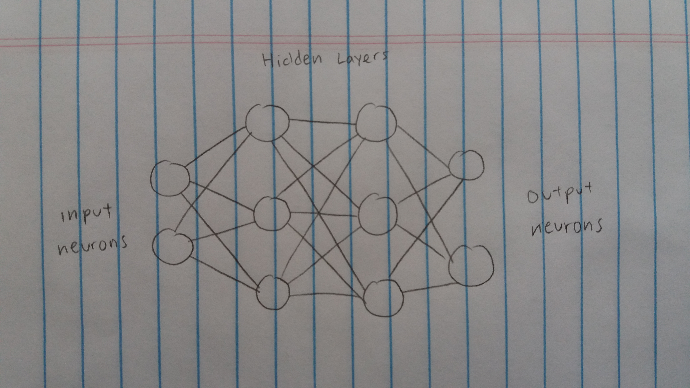
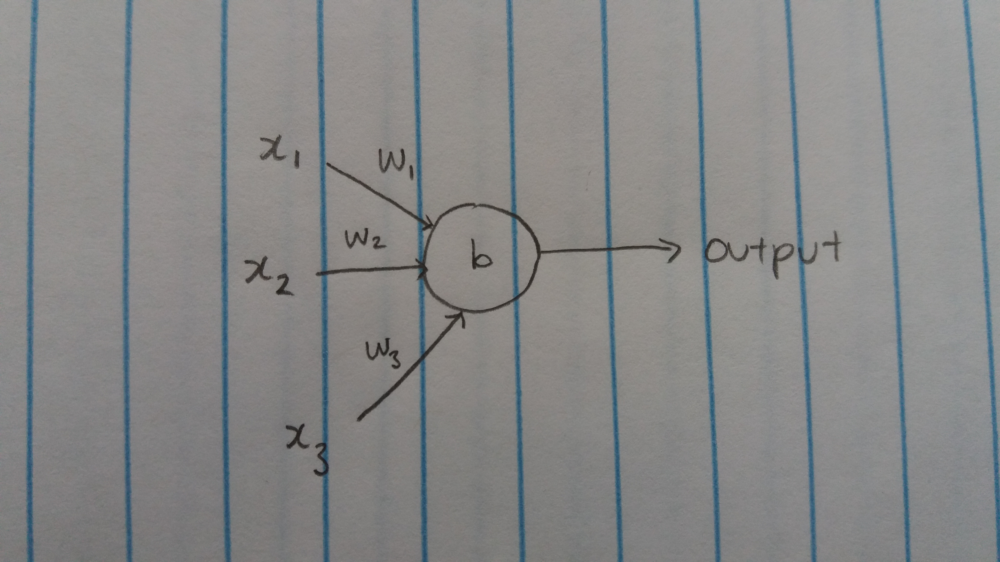

# cannon_nn

## Description
cannon_nn is a model for the VASA cannon that uses the Keras deep learning library for Python. This model has a verification loss on the scale of 10^-4 on verification data. `dnn.py` contains the code for the neural network and explanations of the choices made. 

### Blame
* Jesse Li: visualization, data organization, code structure
* Haoda Wang: neural network, documentation

### Neural Networks: How do they work?
Neural networks and machine learning get a lot of hype in the media (for good reason; they're super cool) but like most things,
they're just math. Neural networks are composed of layers of connected neurons:

Let's take a look at an individual neuron. Each neuron takes any number of inputs (in the picture, labeled x), each between 0 and 1, and **one** output, also between 0 and 1. This output is used as input for other neurons in deeper layers. Each input is assigned a weight (in the picture, w) and the neuron has an overall bias (b). The weights and biases are what encode the information that the neural network ends up learning.

There are two steps to calculate the output of a neuron, based on its inputs:

1. Multiply each input by their appropriate weights, then add up the products. Add the bias to that sum of products.
Mathematically, it looks like `output = (x_1 * w_1) + (x_2 * w_2) + (x_3 * w_3) + b`. If you're clever, you'll notice that this
is really just the dot product of `x` and `w`, and you can actually just pretend that `b` is an extra input with a weight of 1.

2. Take that dot product and run it through an activation function. There are many, including sigmoid, tanh, relu, softplus, and
gaussian, just to name a few. In our project, we used the sigmoid function, `1 / (1 + e^-x)`, which is a smooth S shape from 0
to 1. Here's a Desmos graph you can play with: https://www.desmos.com/calculator/uaoczrzax2

The emergent properties of the interconnected neurons allow the network to approximate any algorithm or function, given
enough time and data to learn from.

Learning is simply gradient descent. A neural network's cost function (in this case, it's our loss function, mean squared error) can be expressed as a function of many variables, or a multidimensional function. Therefore, by finding the gradient at one point of the neural network, we can 

### Sources
* [Adam: A Method for Stochastic Optimization](https://arxiv.org/abs/1412.6980v8)
* [On the Convergence of Adam and Beyond](https://openreview.net/forum?id=ryQu7f-RZ)
* [Keras: The Python Deep Learning library](https://keras.io/)

## Running the program
### Install requirements
`pip install -r requirements.txt`

### Preparing data
The Vasa cannon Doppler radar data comes in the form of Excel workbooks, but for convenience, our scripts assume the data is in `csv` format. `mkcsv.py` will turn the files into `csv` format and normalize the data.

`python mkcsv.py`

### Training
Training should take a minute or five, depending on your computer.

`python dnn.py`

### Usage
There is a handy widget to visualize r(t) and v(t) in `NN_Graphs.ipynb`. This can be accessed with jupyter notebook.
